# Diagrama Entidad-Relación — TM Espert

```mermaid
erDiagram

    %% ═══════════════════════════════════════
    %% USUARIOS Y ROLES
    %% ═══════════════════════════════════════

    Zone {
        int ZoneId PK
        string Name UK
    }

    User {
        int UserId PK
        string Email UK
        string PasswordHash
        string DisplayName
        int ZoneId FK
        int ManagerUserId FK
        int AvatarFileId FK
        bool MustChangePassword
        bool IsActive
        datetime CreatedAt
    }

    Role {
        int RoleId PK
        string Name UK
    }

    UserRole {
        int UserId PK,FK
        int RoleId PK,FK
    }

    Device {
        int DeviceId PK
        int UserId FK
        string DeviceKey UK
        string Platform
        string AppVersion
        datetime LastSeenAt
    }

    DeviceState {
        int DeviceId PK,FK
        datetime LastSyncAt
        int PendingForms
        int PendingPhotos
    }

    SyncLog {
        int SyncLogId PK
        int DeviceId FK
        datetime StartedAt
        datetime FinishedAt
        string Result
    }

    Notification {
        int NotificationId PK
        string Title
        string Message
        string Type
        int Priority
        int CreatedBy FK
        int TargetUserId FK
        datetime ExpiresAt
    }

    UserVacation {
        int UserVacationId PK
        int UserId FK
        date FromDate
        date ToDate
        string Reason
    }

    Holiday {
        int HolidayId PK
        date Date UK
        string Name
        string Kind
    }

    AppSetting {
        string Key PK
        string Value
        string Description
    }

    %% ═══════════════════════════════════════
    %% CANALES Y PRODUCTOS
    %% ═══════════════════════════════════════

    Channel {
        int ChannelId PK
        string Name
        string Description
        bool IsActive
    }

    SubChannel {
        int SubChannelId PK
        int ChannelId FK
        string Name
        string SubCategory2
        bool IsActive
    }

    Product {
        int ProductId PK
        string Name
        string Category
        string Manufacturer
        bool IsOwn
        bool IsActive
        int SortOrder
    }

    Distributor {
        int DistributorId PK
        string Name
        string Phone UK
        string DistributorType
        bool IsActive
    }

    %% ═══════════════════════════════════════
    %% PUNTOS DE VENTA (PDV)
    %% ═══════════════════════════════════════

    PDV {
        int PdvId PK
        string Code UK
        string Name
        string BusinessName
        int ChannelId FK
        int SubChannelId FK
        string Address
        string City
        int ZoneId FK
        int DistributorId FK
        decimal Lat
        decimal Lon
        int AssignedUserId FK
        string TimeSlotsJson
        int MonthlyVolume
        string Category
        bool IsActive
        datetime CreatedAt
    }

    PdvDistributor {
        int PdvDistributorId PK
        int PdvId FK
        int DistributorId FK
    }

    PdvContact {
        int PdvContactId PK
        int PdvId FK
        string ContactName
        string ContactPhone
        string ContactRole
        string DecisionPower
        date Birthday
        string Notes
        string ProfileNotes
    }

    PdvNote {
        int PdvNoteId PK
        int PdvId FK
        string Content
        int CreatedByUserId FK
        int VisitId FK
        bool IsResolved
        int ResolvedByUserId FK
    }

    PdvPhoto {
        int PdvId PK,FK
        int FileId PK,FK
        string PhotoType
        string Url
        int SortOrder
    }

    PdvProductCategory {
        int PdvProductCategoryId PK
        int PdvId FK
        string Category
        string Status
    }

    PdvAssignment {
        int PdvId PK,FK
        int UserId PK,FK
        string AssignmentRole PK
        date StartsOn PK
        date EndsOn
    }

    PdvKpiSnapshot {
        int PdvId PK,FK
        date AsOfDate PK
        decimal CompliancePct
        int VisitsCount
        int IncidentsOpen
    }

    %% ═══════════════════════════════════════
    %% ARCHIVOS
    %% ═══════════════════════════════════════

    File {
        int FileId PK
        string BlobKey UK
        string OriginalName
        string StorageUrl
        string Url
        string ContentType
        bigint SizeBytes
        datetime CreatedAt
    }

    %% ═══════════════════════════════════════
    %% FORMULARIOS
    %% ═══════════════════════════════════════

    Form {
        int FormId PK
        string Name
        int Version
        bool IsActive
        string Frequency
        string FrequencyConfig
        int CreatedByUserId FK
    }

    FormQuestion {
        int QuestionId PK
        int FormId FK
        int FormVersion
        int SortOrder
        string KeyName
        string Label
        string QType
        bool IsRequired
        string RulesJson
    }

    FormOption {
        int OptionId PK
        int QuestionId FK
        string Value
        string Label
        int SortOrder
    }

    %% ═══════════════════════════════════════
    %% RUTAS Y PLANIFICACION
    %% ═══════════════════════════════════════

    Route {
        int RouteId PK
        string Name
        int ZoneId FK
        int AssignedUserId FK
        string FrequencyType
        string FrequencyConfig
        int EstimatedMinutes
        bool IsOptimized
        bool IsActive
        int CreatedByUserId FK
    }

    RouteForm {
        int RouteId PK,FK
        int FormId PK,FK
        int SortOrder
    }

    RoutePdv {
        int RouteId PK,FK
        int PdvId PK,FK
        int SortOrder
        int Priority
    }

    RouteDay {
        int RouteDayId PK
        int RouteId FK
        date WorkDate
        int AssignedUserId FK
        string Status
    }

    RouteDayPdv {
        int RouteDayId PK,FK
        int PdvId PK,FK
        int PlannedOrder
        time PlannedWindowFrom
        time PlannedWindowTo
        int Priority
        string ExecutionStatus
    }

    MandatoryActivity {
        int MandatoryActivityId PK
        string Name
        string ActionType
        string Description
        string DetailsJson
        bool PhotoRequired
        int ChannelId FK
        int RouteId FK
        bool IsActive
    }

    %% ═══════════════════════════════════════
    %% VISITAS
    %% ═══════════════════════════════════════

    Visit {
        int VisitId PK
        int PdvId FK
        int UserId FK
        int RouteDayId FK
        string Status
        datetime OpenedAt
        datetime ClosedAt
        int FormId FK
        string FormStatus
        string CloseReason
    }

    VisitCheck {
        int VisitCheckId PK
        int VisitId FK
        string CheckType
        datetime Ts
        decimal Lat
        decimal Lon
        decimal AccuracyMeters
        decimal DistanceToPdvM
    }

    VisitAnswer {
        int AnswerId PK
        int VisitId FK
        int QuestionId FK
        string ValueText
        decimal ValueNumber
        bool ValueBool
        int OptionId FK
        string ValueJson
    }

    VisitPhoto {
        int VisitId PK,FK
        int FileId PK,FK
        string PhotoType
        string Url
        int SortOrder
    }

    VisitAction {
        int VisitActionId PK
        int VisitId FK
        string ActionType
        string Description
        string DetailsJson
        bool PhotoRequired
        bool PhotoTaken
        string Status
        int MandatoryActivityId FK
    }

    VisitCoverage {
        int VisitCoverageId PK
        int VisitId FK
        int ProductId FK
        bool Works
        decimal Price
        string Availability
    }

    VisitPOPItem {
        int VisitPOPItemId PK
        int VisitId FK
        string MaterialType
        string MaterialName
        string Company
        bool Present
        bool HasPrice
    }

    VisitLooseSurvey {
        int VisitLooseSurveyId PK
        int VisitId FK,UK
        bool SellsLoose
        string ProductsJson
        string ExchangeJson
    }

    VisitFormTime {
        int VisitFormTimeId PK
        int VisitId FK
        int FormId FK
        int ElapsedSeconds
    }

    MarketNews {
        int MarketNewsId PK
        int VisitId FK
        int PdvId FK
        string Tags
        string Notes
        int CreatedBy FK
    }

    Incident {
        int IncidentId PK
        int VisitId FK
        int PdvId FK
        string Type
        string Status
        int Priority
        string Notes
        int CreatedBy FK
    }

    AuditEvent {
        int AuditEventId PK
        datetime Ts
        int UserId FK
        int DeviceId FK
        string Entity
        string EntityId
        string Action
        string PayloadJson
    }

    %% ═══════════════════════════════════════
    %% RELACIONES
    %% ═══════════════════════════════════════

    %% Usuarios
    Zone ||--o{ User : "pertenece"
    Zone ||--o{ PDV : "ubicado en"
    Zone ||--o{ Route : "cubre"
    User ||--o{ UserRole : "tiene"
    Role ||--o{ UserRole : "asignado"
    User ||--o{ Device : "usa"
    Device ||--o| DeviceState : "estado"
    Device ||--o{ SyncLog : "sincroniza"
    User ||--o{ UserVacation : "toma"
    User ||--o| User : "reporta a (Manager)"

    %% Canales
    Channel ||--o{ SubChannel : "contiene"

    %% PDV
    Channel ||--o{ PDV : "clasificado"
    SubChannel ||--o{ PDV : "subclasificado"
    Distributor ||--o{ PDV : "abastece (legacy)"
    PDV ||--o{ PdvDistributor : "distribuido por"
    Distributor ||--o{ PdvDistributor : "distribuye"
    PDV ||--o{ PdvContact : "contactos"
    PDV ||--o{ PdvNote : "notas"
    PDV ||--o{ PdvPhoto : "fotos"
    PDV ||--o{ PdvProductCategory : "categorías"
    PDV ||--o{ PdvAssignment : "asignado a"
    PDV ||--o{ PdvKpiSnapshot : "KPIs"
    File ||--o{ PdvPhoto : "archivo"
    User ||--o{ PdvAssignment : "asignado"

    %% Formularios
    Form ||--o{ FormQuestion : "preguntas"
    FormQuestion ||--o{ FormOption : "opciones"

    %% Rutas
    Route ||--o{ RoutePdv : "incluye"
    Route ||--o{ RouteForm : "usa formulario"
    Route ||--o{ RouteDay : "planificado"
    PDV ||--o{ RoutePdv : "en ruta"
    Form ||--o{ RouteForm : "asignado"
    RouteDay ||--o{ RouteDayPdv : "PDVs del día"
    PDV ||--o{ RouteDayPdv : "planificado"
    User ||--o{ RouteDay : "asignado"
    User ||--o{ Route : "responsable"

    %% Visitas
    PDV ||--o{ Visit : "visitado"
    User ||--o{ Visit : "realiza"
    RouteDay ||--o{ Visit : "originada"
    Visit ||--o{ VisitCheck : "check-in/out"
    Visit ||--o{ VisitAnswer : "respuestas"
    Visit ||--o{ VisitPhoto : "fotos"
    Visit ||--o{ VisitAction : "acciones"
    Visit ||--o{ VisitCoverage : "cobertura"
    Visit ||--o{ VisitPOPItem : "censo POP"
    Visit ||--o| VisitLooseSurvey : "sueltos"
    Visit ||--o{ VisitFormTime : "tiempos"
    Visit ||--o{ MarketNews : "novedades"
    Visit ||--o{ Incident : "incidentes"
    File ||--o{ VisitPhoto : "archivo"
    FormQuestion ||--o{ VisitAnswer : "responde"
    Product ||--o{ VisitCoverage : "producto"
    MandatoryActivity ||--o{ VisitAction : "actividad"

    %% Notificaciones y Auditoría
    User ||--o{ Notification : "recibe"
    User ||--o{ AuditEvent : "genera"
    User ||--o{ Incident : "reporta"
    User ||--o{ MarketNews : "reporta"
    Channel ||--o{ MandatoryActivity : "aplica"
```

## Estadísticas

| Grupo | Tablas |
|-------|--------|
| Usuarios y roles | User, Role, UserRole, Zone, Device, DeviceState, SyncLog, Notification, UserVacation, Holiday, AppSetting |
| Canales y productos | Channel, SubChannel, Product, Distributor |
| Puntos de venta | PDV, PdvDistributor, PdvContact, PdvNote, PdvPhoto, PdvProductCategory, PdvAssignment, PdvKpiSnapshot |
| Archivos | File |
| Formularios | Form, FormQuestion, FormOption |
| Rutas y planificacion | Route, RouteForm, RoutePdv, RouteDay, RouteDayPdv, MandatoryActivity |
| Visitas | Visit, VisitCheck, VisitAnswer, VisitPhoto, VisitAction, VisitCoverage, VisitPOPItem, VisitLooseSurvey, VisitFormTime, MarketNews, Incident |
| Auditoria | AuditEvent |

**Total: 46 tablas**
